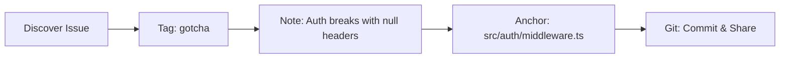

# a24z-memory: Layered Knowledge Architecture

A retrieval-oriented memory system that prevents knowledge staleness through anchor-based context.

## The Knowledge Stack

**Tag Layer** - Semantic categories for discovery (`bug`, `pattern`, `decision`)  
**Note Layer** - Insights and explanations  
**Anchor Layer** - Connections to actual code locations  
**Git Layer** - Distribution + evolution history of team understanding

This stack means knowledge stays organized (tags), meaningful (notes), current (anchors), and shared (git). Plus git history shows how insights accumulated over time - you can see not just what the team knows, but how they learned it.

### Knowledge Creation

When you discover something important:



### Knowledge Retrieval  

When you need to understand something:


### Why This Works

Unlike traditional RAG that embeds content and hopes it stays relevant, we anchor knowledge to code locations:

- **Notes point to code** via file/directory anchors, not embedded content
- **Context stays fresh** because we read the current state of your files  
- **Knowledge doesn't rot** - anchors ensure notes remain relevant to actual code
- **Retrieval-first design** - optimized for finding the right context, not storing it

MCP Server Bundle for Cursor, Windsurf, Claude Code, Gemini CLI, VS Code, and Jules.

## Quick Start

### 1. Installation

```bash
# Install globally (recommended)
npm install -g a24z-memory

# Or install locally in your project
npm install a24z-memory --save-dev

# Verify installation
npx a24z-memory --help
```

### 2. Start the MCP Server

```bash
# Start the server (keep this terminal running)
npx a24z-memory

# Expected output:
# ✅ a24z-Memory MCP server started successfully
# 📁 MCP Server working directory: /path/to/cwd
# 📁 MCP Server __dirname: /path/to/installation
```

### 3. Test Your Setup

```bash
# In another terminal, test basic functionality
# Try calling: discover_a24z_tools({ category: "all" })
```

## Automated Setup

For some editors, you can run the following commands for a one-click install:

**Cursor:**

[](https://cursor.com/en/install-mcp?name=a24z-memory&config=eyJjb21tYW5kIjoibnB4IC15IGEyNHotbWVtb3J5In0%3D)


## Manual Integration

```json
{
  "mcpServers": {
    "a24z-memory": {
      "command": "npx",
      "args": [
        "-y",
        "a24z-memory"
      ]
    }
  }
}
```

### Jules
Refer to Jules MCP configuration; define a server named `a24z-memory` with the same `command`, `args`, and `env`.

## Usage with AI Agents

### Quick Setup (2 minutes)

1. **Start the server**: `npx a24z-memory` (keep running)
2. **Copy system prompt** from below into your AI agent
3. **Test**: Ask your AI "What a24z-Memory tools are available?"

```markdown
When working on development tasks, you have access to a a24z-memory MCP server...

### Available Tools
#### discover_a24z_tools
#### askA24zMemory
#### create_repository_note
#### get_repository_tags
#### get_repository_guidance
#### copy_guidance_template

### Best Practices
1. Check existing knowledge before starting work
2. Use absolute paths starting with /
3. Document insights after solving problems
```

### Advanced Configuration

For detailed setup instructions, comprehensive troubleshooting, and complete system prompt examples:

📖 **[Complete AI Agent Integration Guide](./USAGE_GUIDE.md)**
- ✅ Complete system prompt with all 6 tools
- ✅ IDE-specific setup instructions
- ✅ Troubleshooting checklist for common issues
- ✅ Advanced configuration options


## Troubleshooting

If your LLM isn't using the a24z-Memory tools, check these common issues:

### 🔍 **Server Not Starting**
```bash
# Check if the server starts without errors
npx a24z-memory

# Expected: "✅ a24z-Memory MCP server started successfully"
# If you see errors, check Node.js version (requires v16+)
node --version
```

### 🔍 **LLM Not Discovering Tools**
1. **Verify server is running** in a separate terminal
2. **Check system prompt** includes the complete tool definitions
3. **Test tool discovery**: Try calling `discover_a24z_tools({ category: "all" })`
4. **Verify tool names** match exactly (no `mcp__` prefixes needed)

### 🔍 **"Path must be absolute" Errors**
```bash
# Always use absolute paths starting with /
pwd  # Get your current directory
# Example: /Users/username/projects/my-repo
```

### 🔍 **"Not a git repository" Errors**
```bash
# Ensure you're in a git repository
git status

# If not a git repo, initialize one
git init
```

### 🔍 **Empty Query Results**
- Try broader queries like "What's known about this file?"
- Check if any notes exist in `.a24z/repository-notes.json`
- Use different file paths or remove filters

### 🔍 **Debug Mode**
```bash
# Enable debug logging
DEBUG=a24z-memory:* npx a24z-memory
```

For detailed troubleshooting steps, see the **[Complete MCP Setup Checklist](./USAGE_GUIDE.md#complete-mcp-setup-checklist-for-llm-integration)**.

## Available Tools

The MCP server provides these tools:

- **`askA24zMemory`** - Search tribal knowledge and get contextual guidance
- **`create_repository_note`** - Document insights and decisions
- **`get_repository_tags`** - Manage note categorization tags
- **`get_repository_guidance`** - Get repository-specific guidance
- **`copy_guidance_template`** - Copy documentation templates
- **`discover_a24z_tools`** - Discover all available tools and capabilities

## Programmatic use

```ts
import { run } from "a24z-memory";
run();
```
