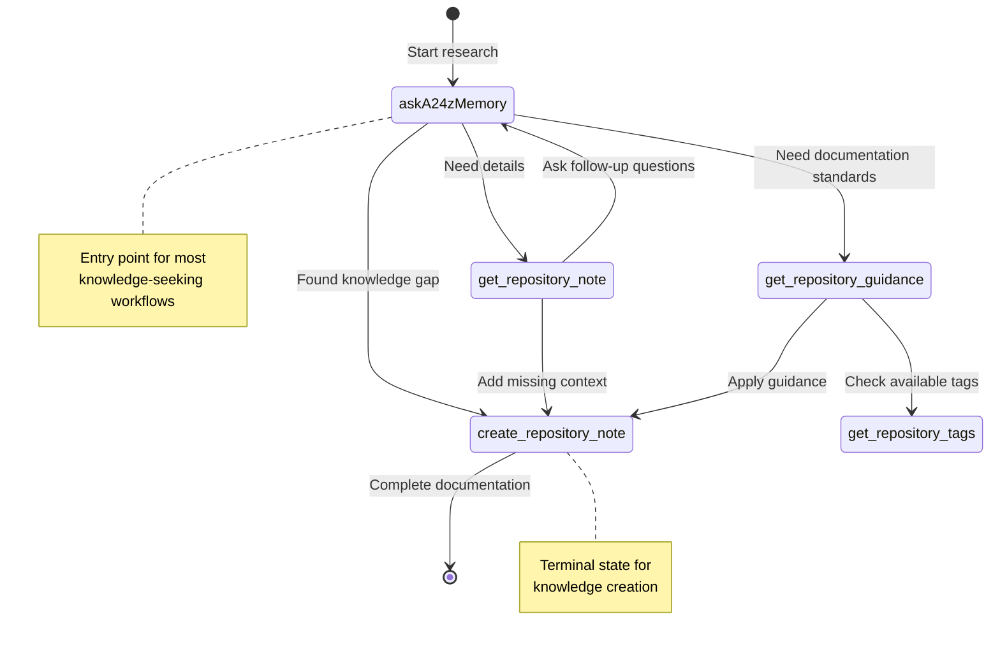
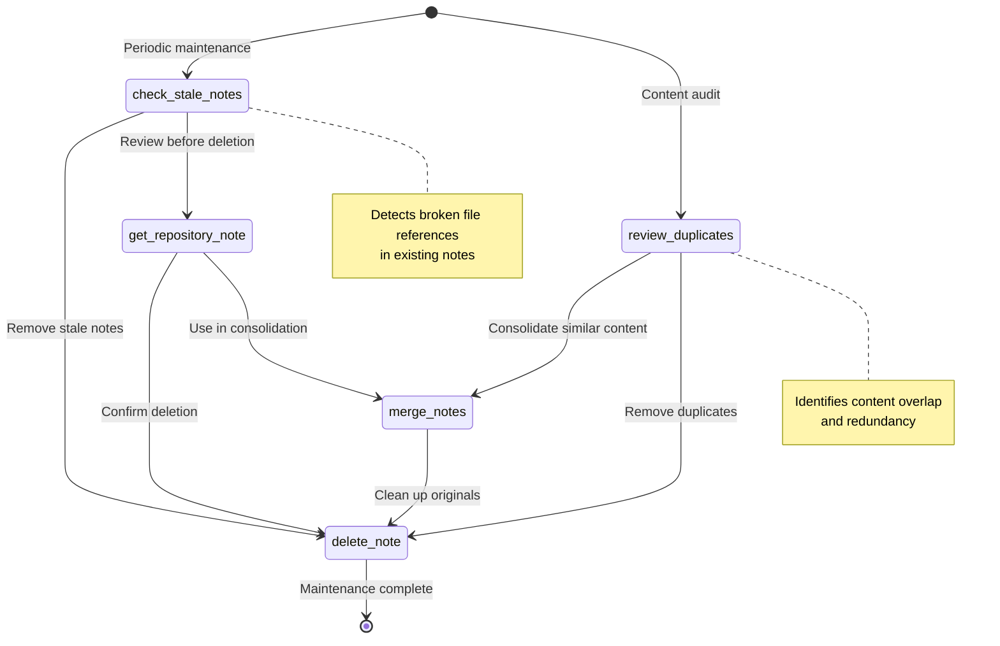
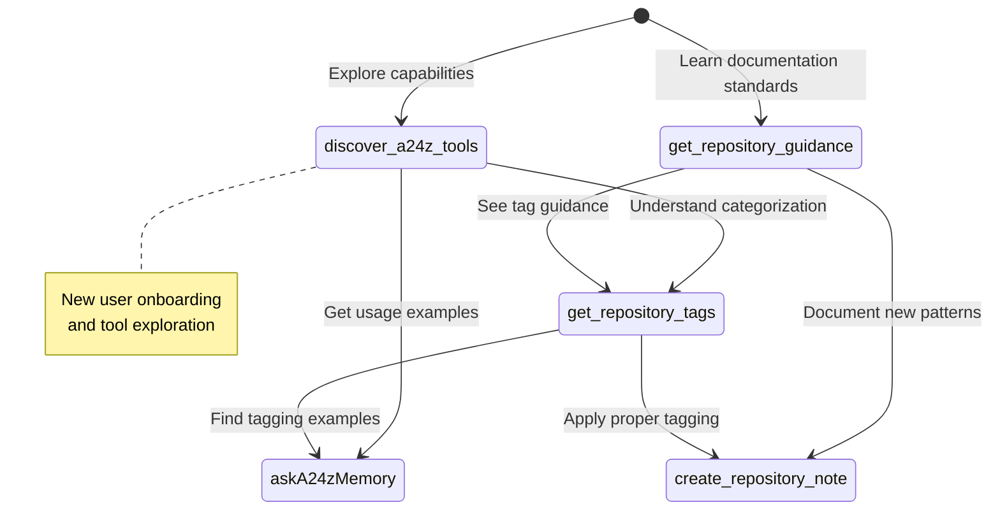

# a24z-Memory Tool Workflows - Markov Chain Analysis

## Primary Knowledge Workflow

## Maintenance & Cleanup Workflow

## Tool Discovery & Setup Workflow

## Transition Probability Matrix

Based on typical usage patterns:

| From → To                   | askA24zMemory | create_note | get_note | get_guidance | get_tags | delete_note | merge_notes | check_stale | review_dup | discover |
| --------------------------- | ------------- | ----------- | -------- | ------------ | -------- | ----------- | ----------- | ----------- | ---------- | -------- |
| **askA24zMemory**           | -             | 0.4         | 0.3      | 0.2          | 0.1      | -           | -           | -           | -          | -        |
| **create_repository_note**  | -             | -           | -        | -            | -        | -           | -           | -           | -          | -        |
| **get_repository_note**     | 0.3           | 0.4         | -        | -            | -        | 0.3         | -           | -           | -          | -        |
| **get_repository_guidance** | -             | 0.6         | -        | -            | 0.4      | -           | -           | -           | -          | -        |
| **get_repository_tags**     | 0.2           | 0.5         | -        | -            | -        | -           | -           | -           | -          | -        |
| **delete_note**             | -             | -           | -        | -            | -        | -           | -           | -           | -          | -        |
| **merge_notes**             | -             | -           | -        | -            | -        | 0.7         | -           | -           | -          | -        |
| **check_stale_notes**       | -             | -           | 0.4      | -            | -        | 0.6         | -           | -           | -          | -        |
| **review_duplicates**       | -             | -           | -        | -            | -        | 0.3         | 0.7         | -           | -          | -        |
| **discover_a24z_tools**     | 0.4           | -           | -        | 0.3          | 0.3      | -           | -           | -           | -          | -        |

**Legend:**

- **Terminal States**: create_repository_note, delete_note (end workflows)
- **Entry States**: askA24zMemory, discover_a24z_tools, check_stale_notes, review_duplicates
- **Transition States**: get_repository_note, get_repository_guidance, get_repository_tags, merge_notes
