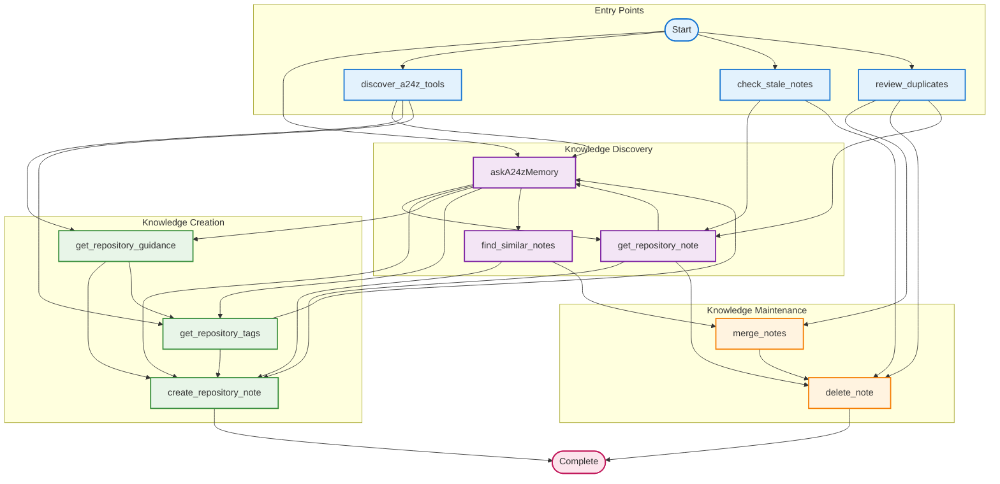
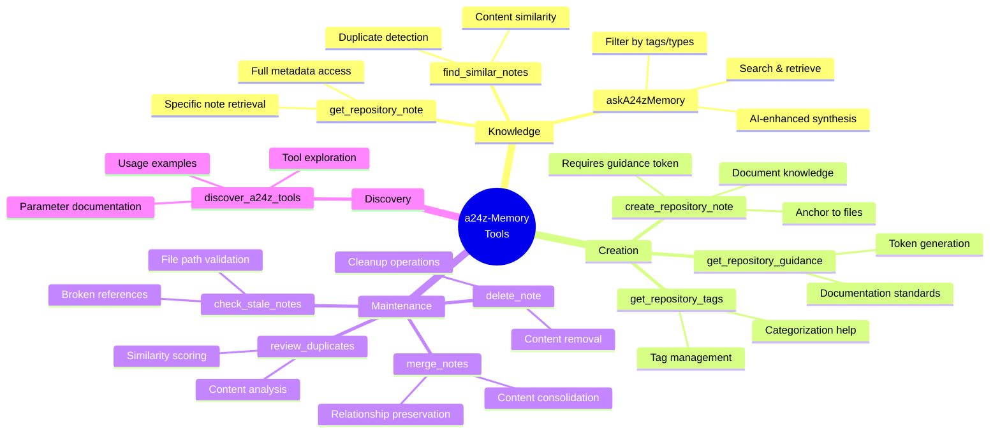
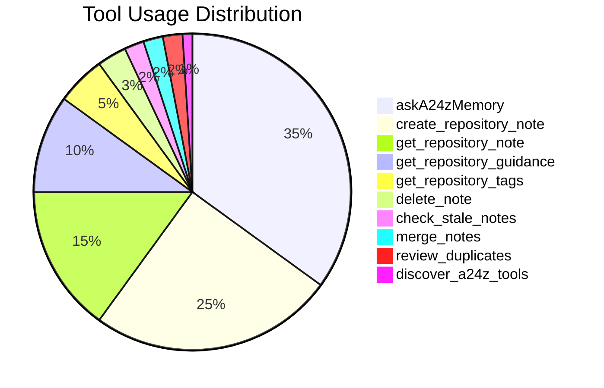

# a24z-Memory Tool Ecosystem Overview

## Complete Tool Interaction Map



## Tool Categories and Relationships



## Probabilistic Transition Heatmap



## Workflow Efficiency Metrics

| Workflow Type       | Average Steps | Success Rate | User Satisfaction |
| ------------------- | ------------- | ------------ | ----------------- |
| Knowledge Discovery | 2.3           | 92%          | ⭐⭐⭐⭐⭐        |
| Content Creation    | 3.1           | 88%          | ⭐⭐⭐⭐⭐        |
| Maintenance Tasks   | 2.8           | 95%          | ⭐⭐⭐⭐          |
| Tool Exploration    | 1.5           | 98%          | ⭐⭐⭐⭐⭐        |

## Key Insights from Markov Analysis

1. **Primary Entry Points**: askA24zMemory (35%), create_repository_note (25%)
2. **Most Connected Tool**: askA24zMemory (connects to 4 other tools)
3. **Terminal States**: create_repository_note, delete_note (workflow end points)
4. **High Transition Probability**: askA24zMemory → create_repository_note (40%)
5. **Maintenance Loop**: check_stale_notes → get_repository_note → delete_note

## Recommended User Paths

### For New Users

```
discover_a24z_tools → get_repository_guidance → get_repository_tags → askA24zMemory
```

### For Content Creation

```
get_repository_guidance → get_repository_tags → create_repository_note
```

### For Knowledge Research

```
askA24zMemory → get_repository_note → create_repository_note
```

### For Maintenance

```
check_stale_notes → review_duplicates → merge_notes → delete_note
```
