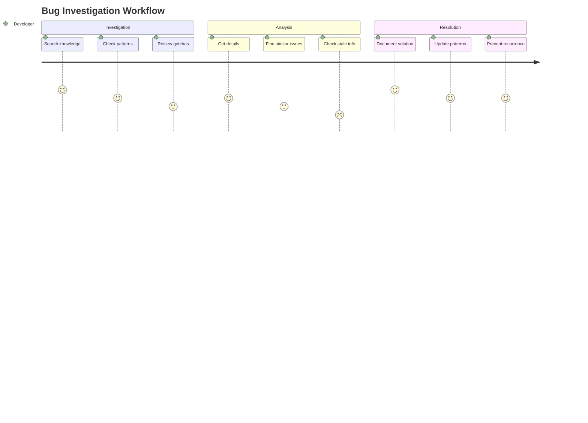
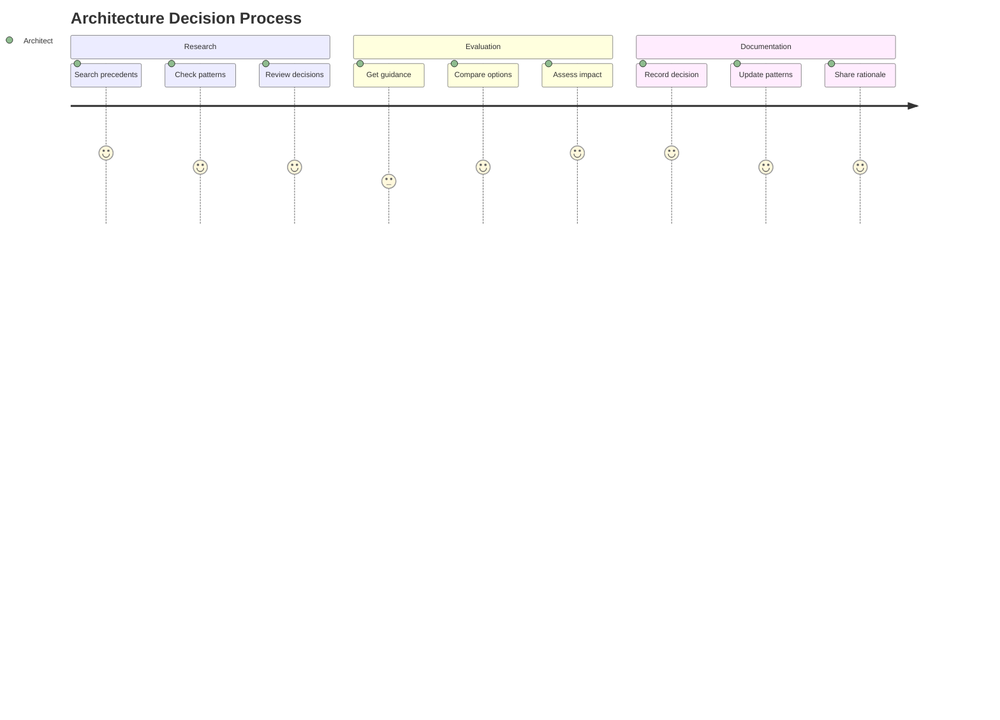
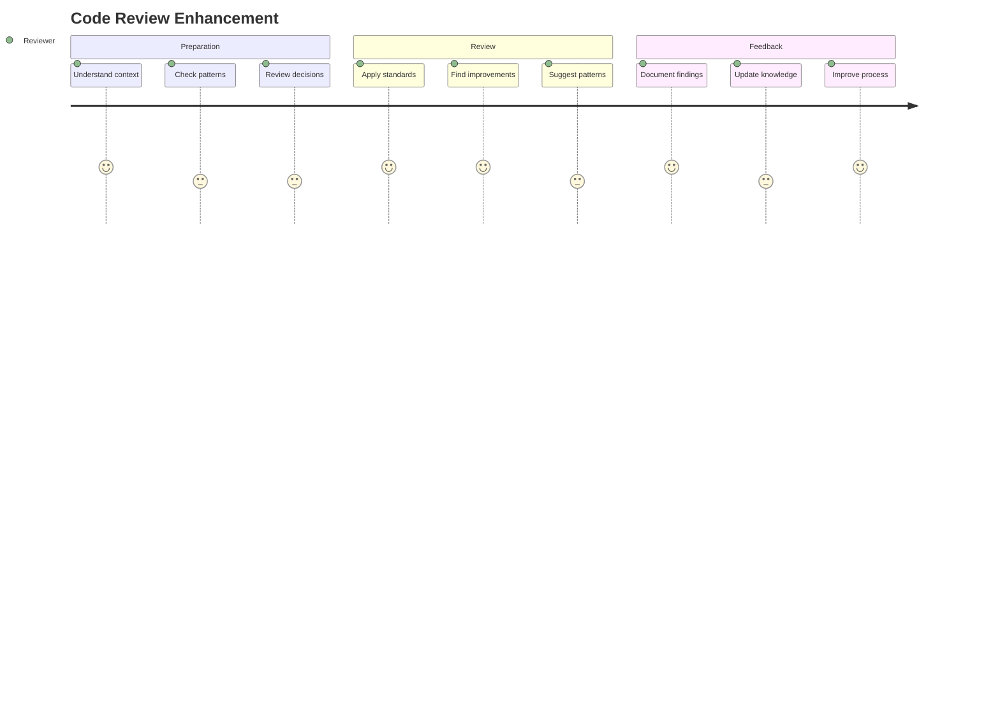
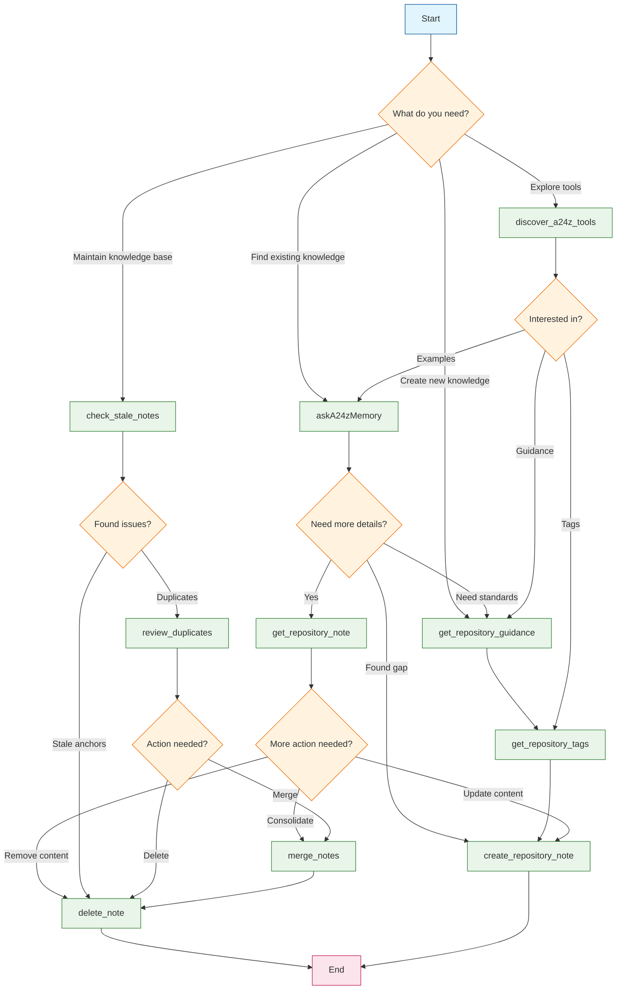

# User Journey Workflows

## New Developer Onboarding Journey

```mermaid
journey
    title New Developer Onboarding
    section Discovery
        Discover tools: 5: Developer
        Read guidance: 4: Developer
        Check tags: 3: Developer
    section Learning
        Ask questions: 4: Developer
        Get examples: 3: Developer
        Find patterns: 4: Developer
    section Contributing
        Create notes: 5: Developer
        Document decisions: 4: Developer
        Share knowledge: 5: Developer
```

## Bug Investigation Journey

```mermaid
journey
    title Bug Investigation Workflow
    section Investigation
        Search knowledge: 5: Developer
        Check patterns: 4: Developer
        Review gotchas: 3: Developer
    section Analysis
        Get details: 4: Developer
        Find similar issues: 3: Developer
        Check stale info: 2: Developer
    section Resolution
        Document solution: 5: Developer
        Update patterns: 4: Developer
        Prevent recurrence: 4: Developer
```

## Architecture Decision Journey

```mermaid
journey
    title Architecture Decision Process
    section Research
        Search precedents: 5: Architect
        Check patterns: 4: Architect
        Review decisions: 4: Architect
    section Evaluation
        Get guidance: 3: Architect
        Compare options: 4: Architect
        Assess impact: 5: Architect
    section Documentation
        Record decision: 5: Architect
        Update patterns: 4: Architect
        Share rationale: 4: Architect
```

## Code Review Journey

```mermaid
journey
    title Code Review Enhancement
    section Preparation
        Understand context: 4: Reviewer
        Check patterns: 3: Reviewer
        Review decisions: 3: Reviewer
    section Review
        Apply standards: 4: Reviewer
        Find improvements: 4: Reviewer
        Suggest patterns: 3: Reviewer
    section Feedback
        Document findings: 4: Reviewer
        Update knowledge: 3: Reviewer
        Improve process: 4: Reviewer
```

## Detailed State Transition Flow

```mermaid
flowchart TD
    A[Start] --> B{What do you need?}
    B -->|Find existing knowledge| C[askA24zMemory]
    B -->|Create new knowledge| D[get_repository_guidance]
    B -->|Maintain knowledge base| E[check_stale_notes]
    B -->|Explore tools| F[discover_a24z_tools]

    C --> G{Need more details?}
    G -->|Yes| H[get_repository_note]
    G -->|Found gap| I[create_repository_note]
    G -->|Need standards| D

    D --> J[get_repository_tags]
    J --> I

    H --> K{More action needed?}
    K -->|Update content| I
    K -->|Remove content| L[delete_note]
    K -->|Consolidate| M[merge_notes]

    E --> N{Found issues?}
    N -->|Stale anchors| L
    N -->|Duplicates| O[review_duplicates]

    O --> P{Action needed?}
    P -->|Merge| M
    P -->|Delete| L

    M --> L
    L --> Q[End]
    I --> Q

    F --> R{Interested in?}
    R -->|Tags| J
    R -->|Guidance| D
    R -->|Examples| C

    classDef startEnd fill:#e1f5fe,stroke:#01579b
    classDef decision fill:#fff3e0,stroke:#ef6c00
    classDef action fill:#e8f5e8,stroke:#2e7d32
    classDef terminal fill:#fce4ec,stroke:#c2185b

    class A,Q startEnd
    class B,G,K,N,P,R decision
    class C,D,E,F,H,I,J,L,M,O action
    class Q terminal
```
